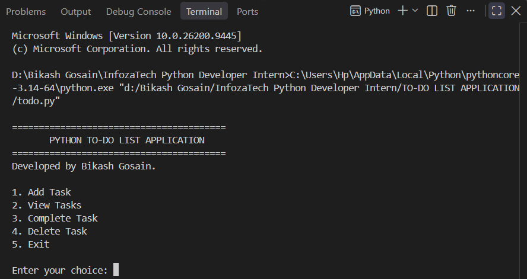
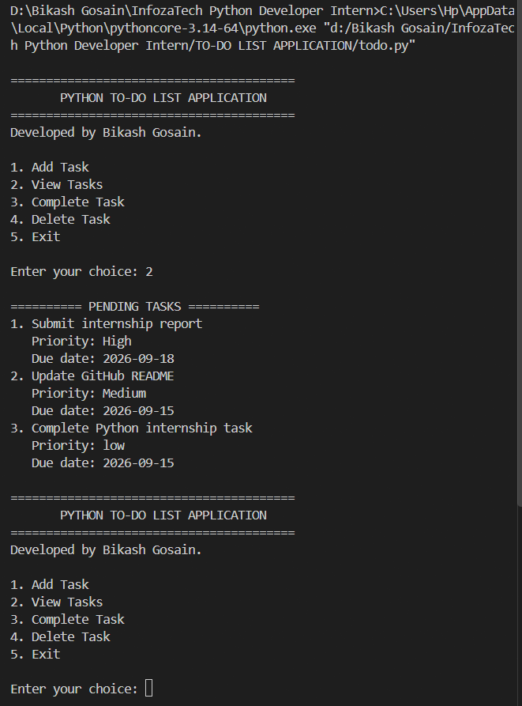
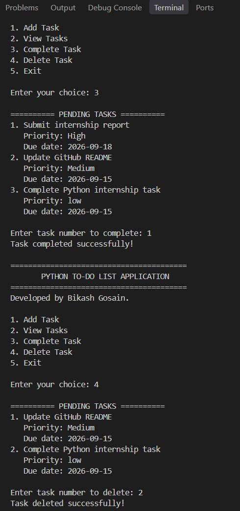
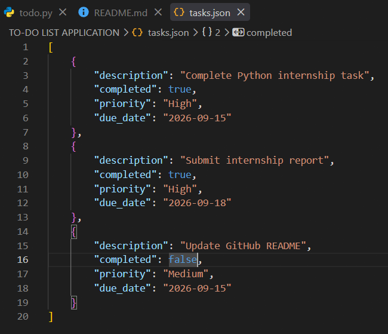

# Python To-Do List Application

A command-line To-Do List application built with Python as part of the **InfozaTech Python Development Internship – Task 1**.

The application allows users to create, view, complete, and delete tasks while storing task data in a JSON file so that tasks persist between program runs.

## Features

* Add new tasks with a short description
* View all pending tasks in a numbered list
* Mark tasks as completed
* Delete tasks
* Persistent data storage using JSON
* Set task priority:

  * High
  * Medium
  * Low
* Set due dates using `YYYY-MM-DD` format
* Automatically sort tasks by priority and due date
* Validate task descriptions, priorities, dates, and task numbers
* Handle missing or invalid JSON data safely
* No external Python packages required

## Bonus Features

The application extends the basic requirements with:

* **Task Priority** — High, Medium, and Low
* **Due Dates** — Assign deadlines to tasks
* **Smart Sorting** — Tasks are displayed by priority and then due date
* **Input Validation** — Prevents invalid priority values, dates, and task numbers

## Screenshots

### Main Menu



### Task List with Priority and Due Dates



### Completing and Deleting Tasks



### JSON Data Persistence



## Technologies Used

* **Python 3**
* **JSON** — Task data persistence
* **pathlib** — File path handling
* **datetime** — Due date validation
* **Command-Line Interface (CLI)**

## Project Structure

```text
TO-DO LIST APPLICATION/
│
├── todo.py
├── tasks.json
├── README.md
│
└── Screenshots/
    ├── main-menu.png
    ├── priority-task-list.png
    ├── task-complete-and-delete.png
    └── jsondata.png
```

## How to Run

### 1. Clone or download the project

Open the project folder in your terminal.

### 2. Run the application

```bash
python todo.py
```

### 3. Use the menu

```text
========================================
       PYTHON TO-DO LIST APPLICATION
========================================
1. Add Task
2. View Tasks
3. Complete Task
4. Delete Task
5. Exit
```

Select an option by entering the corresponding number.

## Task Data Storage

Task information is stored locally in:

```text
tasks.json
```

Example:

```json
[
    {
        "description": "Complete internship task",
        "completed": false,
        "priority": "High",
        "due_date": "2026-09-15"
    }
]
```

The application automatically loads existing tasks when it starts and saves changes whenever tasks are added, completed, or deleted.

## Task Requirements

| Requirement           | Implementation                                 |
| --------------------- | ---------------------------------------------- |
| Add a new task        | Users can add tasks with a description         |
| Display pending tasks | Pending tasks are displayed in a numbered list |
| Complete a task       | Users can mark pending tasks as completed      |
| Remove a task         | Users can delete pending tasks                 |
| Persistent storage    | Tasks are stored in `tasks.json`               |
| Bonus: Due dates      | Users can assign a due date                    |
| Bonus: Priority       | Tasks support High, Medium, and Low priority   |
| Bonus: Sorting        | Tasks are sorted by priority and due date      |

## Input Validation

The application validates:

* Empty task descriptions
* Invalid priority values
* Incorrect due-date formats
* Invalid task numbers
* Invalid menu choices
* Missing or corrupted JSON data

Due dates must use the following format:

```text
YYYY-MM-DD
```

Example:

```text
2026-09-15
```

## No External Dependencies

This project uses only Python's built-in libraries, so no `pip install` or `requirements.txt` is required.

## Internship Task

**Program:** Python Development Internship
**Organization:** InfozaTech
**Task:** Task 1 – To-Do List Application

This project demonstrates fundamental Python programming concepts including functions, lists, dictionaries, file handling, JSON persistence, input validation, sorting, and command-line interaction.
