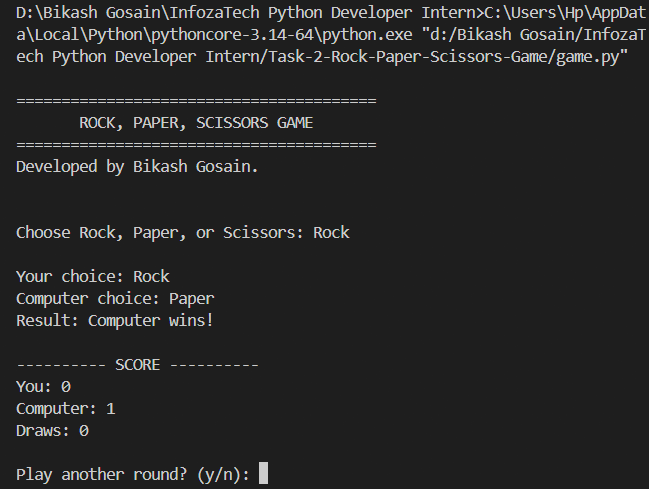
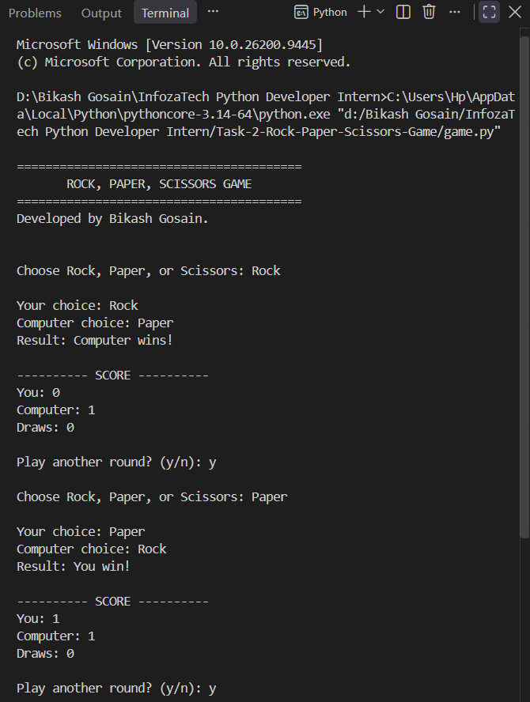
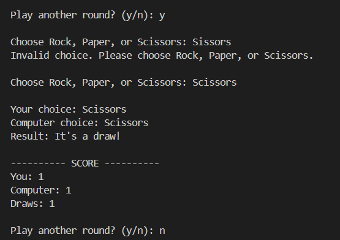
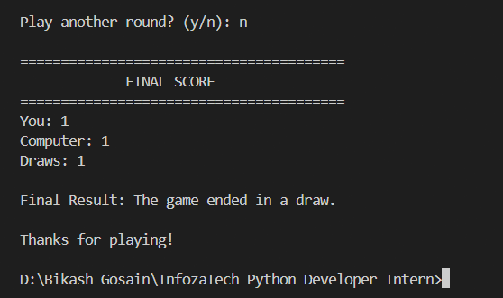

# Rock, Paper, Scissors Game

A command-line **Rock, Paper, Scissors** game built with Python as part of the **InfozaTech Python Programming Internship – Task 2**.

The game allows the user to play multiple rounds against the computer, keeps a running score, and displays the final result at the end.

## Features

* Choose Rock, Paper, or Scissors
* Computer randomly selects an option
* Automatically determines the winner of each round
* Displays the result of every round
* Maintains a running score
* Tracks draws separately
* Supports multiple rounds
* Displays the final score at the end
* Validates user input
* Allows the user to decide whether to continue playing

## Game Rules

The game follows the standard rules:

* **Rock beats Scissors**
* **Scissors beats Paper**
* **Paper beats Rock**
* Matching choices result in a draw

## Screenshots

### First Round



### Multiple Rounds and Running Score



### Invalid Input Validation



### Final Scores



## Technologies Used

* **Python 3**
* **random** — used to generate the computer's random choice
* **Command-Line Interface (CLI)**

## Project Structure

```text
Task-2-Rock-Paper-Scissors-Game/
│
├── game.py
├── README.md
│
└── Screenshots/
    ├── first-round.png
    ├── multiple-round.png
    ├── invalid-input.png
    └── final-scores.png
```

## How to Run

Open a terminal in the project directory and run:

```bash
python game.py
```

Then choose:

```text
Rock
Paper
Scissors
```

The computer will randomly select its choice and the winner will be displayed.

## Task Requirements

| Requirement                           | Implementation                       |
| ------------------------------------- | ------------------------------------ |
| User chooses Rock, Paper, or Scissors | Implemented                          |
| Computer randomly chooses an option   | Implemented using Python `random`    |
| Compare choices and determine winner  | Implemented                          |
| Display result of each round          | Implemented                          |
| Maintain running score                | Implemented                          |
| Support multiple rounds               | Implemented                          |
| Display final score                   | Implemented                          |
| Input validation                      | Implemented as an additional feature |

## Concepts Demonstrated

This project demonstrates practical use of:

* Functions
* Conditional statements
* Dictionaries
* Lists
* Loops
* User input
* Random number generation
* Input validation
* Score tracking
* Modular program structure

## Internship Task

**Program:** Python Programming Internship
**Organization:** InfozaTech
**Task:** Task 2 – Rock, Paper, Scissors Game

This project was developed as part of the hands-on programming tasks assigned during the internship.