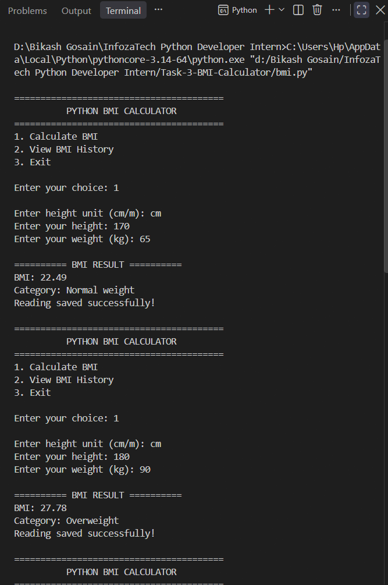
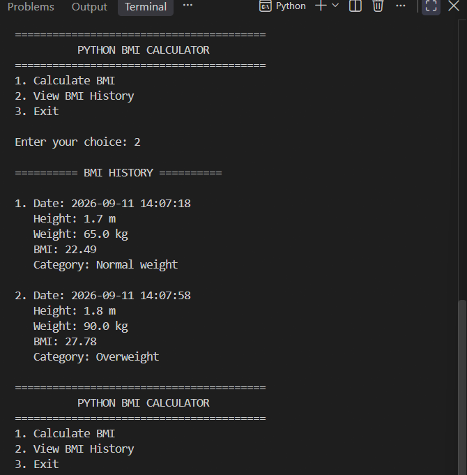
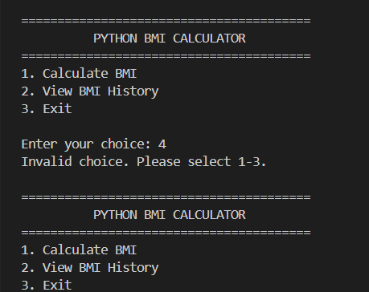
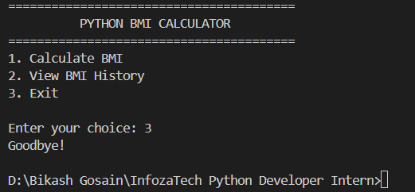

# BMI Calculator

A command-line **BMI (Body Mass Index) Calculator** built with Python as part of the **InfozaTech Python Programming Internship – Task 3**.

The application accepts height and weight, calculates BMI using the standard formula, classifies the result into a BMI category, and stores previous readings for later review.

## Features

* Accept height in centimeters or meters
* Accept weight in kilograms
* Calculate BMI using the standard BMI formula
* Classify BMI into:

  * Underweight
  * Normal weight
  * Overweight
  * Obese
* Display the calculated BMI and category
* Save BMI readings to a JSON file
* View previous BMI readings
* Store date and time for each reading
* Validate height, weight, units, and menu input

## BMI Formula

The BMI is calculated using:

```text
BMI = Weight (kg) / Height² (m)
```

For example:

```text
Height = 170 cm = 1.70 m
Weight = 65 kg

BMI = 65 / (1.70 × 1.70)
    = 22.49
```

## BMI Categories

| BMI Range      | Category      |
| -------------- | ------------- |
| Below 18.5     | Underweight   |
| 18.5 – 24.9    | Normal weight |
| 25.0 – 29.9    | Overweight    |
| 30.0 and above | Obese         |

## Bonus Feature — BMI History

The application saves previous BMI readings in:

```text
bmi_history.json
```

Each saved reading contains:

* Date and time
* Height
* Weight
* BMI
* BMI category

Users can select **View BMI History** from the main menu to review previous readings and compare changes over time.

## Screenshots

### BMI Calculation



### BMI History



### Input Validation



### Final Menu



## Technologies Used

* **Python 3**
* **JSON** — persistent BMI history
* **datetime** — date and time for saved readings
* **pathlib** — file path handling
* **Command-Line Interface (CLI)**

## Project Structure

```text
Task-3-BMI-Calculator/
│
├── bmi.py
├── bmi_history.json
├── README.md
│
└── Screenshots/
    ├── bmi-calculation.png
    ├── bmi-history.png
    ├── input-validation.png
    └── final-menu.png
```

## How to Run

Open a terminal in the project directory and run:

```bash
python bmi.py
```

The application displays the following menu:

```text
========================================
          PYTHON BMI CALCULATOR
========================================
1. Calculate BMI
2. View BMI History
3. Exit
```

Select an option by entering the corresponding number.

## Input Validation

The application validates:

* Height unit (`cm` or `m`)
* Positive height values
* Positive weight values
* Numeric input
* Invalid menu choices

Invalid input is rejected and the user is prompted to enter a valid value.

## Task Requirements

| Requirement              | Implementation                                |
| ------------------------ | --------------------------------------------- |
| Take height as input     | Supports cm and m                             |
| Take weight as input     | Supports kg                                   |
| Calculate BMI            | Standard BMI formula                          |
| Classify BMI             | Underweight, Normal weight, Overweight, Obese |
| Display BMI and category | Implemented                                   |
| Save past readings       | Implemented using JSON                        |
| View BMI history         | Implemented as a bonus feature                |

## Concepts Demonstrated

This project demonstrates practical use of:

* Functions
* Conditional statements
* Loops
* Lists and dictionaries
* User input
* Input validation
* Mathematical calculations
* JSON file handling
* Date and time handling
* Persistent data storage
* Command-line application development

## Internship Task

**Program:** Python Programming Internship
**Organization:** InfozaTech
**Task:** Task 3 – BMI Calculator

This project was developed as part of the hands-on programming tasks assigned during the internship.
