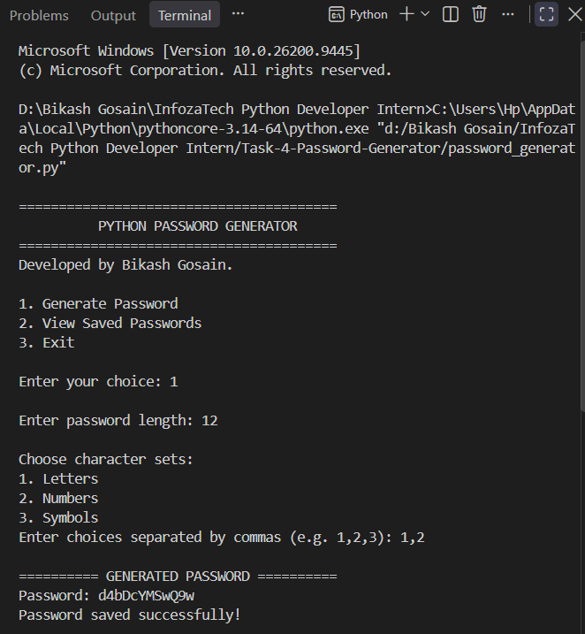
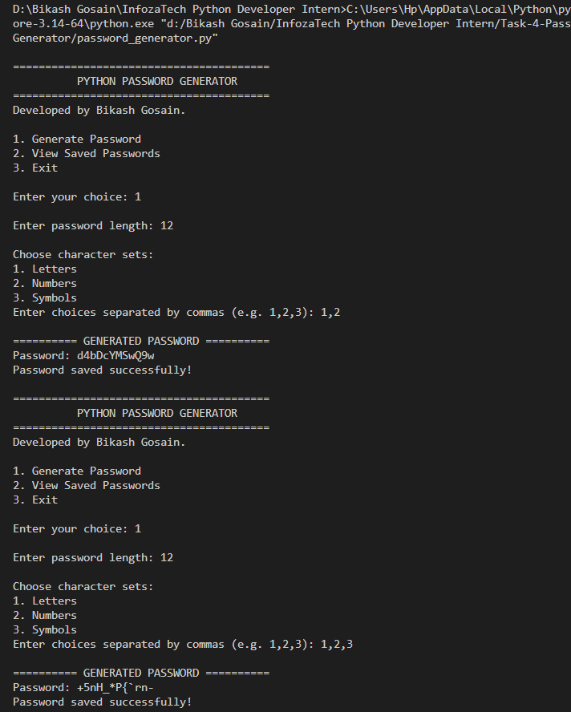
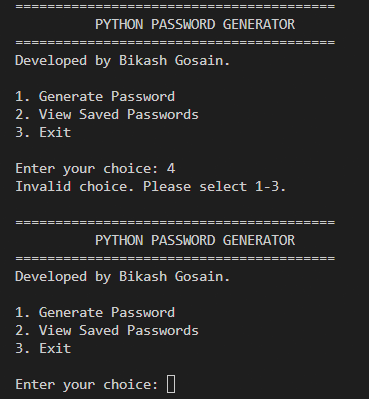
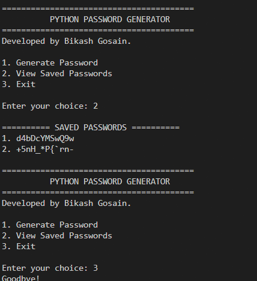

# Task 4 – Password Generator

A Python-based password generator developed as part of my **InfozaTech Python Programming Virtual Internship**.

## 📌 Overview

This project is a command-line password generator that allows users to create passwords based on their desired length and selected character sets.

The application supports **letters, numbers, and symbols**, validates user input, and saves generated passwords to a JSON file for persistence.

It also includes the bonus functionality of generating and saving **multiple passwords during the same session**.

## ✨ Features

* Generate random passwords
* Choose the desired password length
* Select character sets:

  * Letters
  * Numbers
  * Symbols
* Input validation
* Generate multiple passwords in one session
* Save generated passwords to a JSON file
* View previously saved passwords
* Simple interactive command-line interface

## 🛠️ Technologies Used

* **Python 3**
* `secrets` – secure random password generation
* `string` – predefined character sets
* `json` – storing generated passwords
* `pathlib` – handling file paths

## 📂 Project Structure

```text
Task-4-Password-Generator/
├── README.md
├── password_generator.py
├── saved_passwords.json
└── Screenshots/
    ├── password-generation.png
    ├── multiple-passwords.png
    ├── input-validation.png
    └── saved-passwords.png
```

## ▶️ How to Run

Make sure Python is installed on your system.

Run the following command from the project directory:

```bash
python password_generator.py
```

## 🖥️ Application Menu

```text
========================================
          PYTHON PASSWORD GENERATOR
========================================
1. Generate Password
2. View Saved Passwords
3. Exit
```

### 1. Generate Password

The user can enter the desired password length and select the required character sets.

Example:

```text
Enter password length: 12

Choose character sets:
1. Letters
2. Numbers
3. Symbols
Enter choices separated by commas (e.g. 1,2,3): 1,2,3

========== GENERATED PASSWORD ==========
Password: Example123!@
Password saved successfully!
```

### 2. View Saved Passwords

Previously generated passwords can be viewed from the application menu.

```text
========== SAVED PASSWORDS ==========
1. Example123!@
2. Python@2026
3. Secure#456
```

### 3. Exit

Selecting option `3` exits the application.

## ✅ Requirements Implemented

This project implements the assigned internship requirements:

| Requirement                     | Implementation                                           |
| ------------------------------- | -------------------------------------------------------- |
| Ask for desired password length | User enters the required password length                 |
| Choose character sets           | Letters, numbers, and symbols can be selected            |
| Random password generation      | Passwords are generated using Python's `secrets` module  |
| Display generated password      | Generated password is displayed in the terminal          |
| Multiple passwords              | Multiple passwords can be generated during one session   |
| Save passwords                  | Generated passwords are stored in `saved_passwords.json` |
| Input validation                | Invalid length and character-set inputs are handled      |

## 🔐 Password Generation

The project uses Python's `secrets` module instead of the basic `random` module for password generation.

The available character sets are provided by Python's `string` module:

* Letters: `string.ascii_letters`
* Numbers: `string.digits`
* Symbols: `string.punctuation`

This makes the password generation more suitable for security-related demonstrations.

## 💾 Data Persistence

Generated passwords are saved in:

```text
saved_passwords.json
```

The application loads previously saved passwords when it starts and updates the JSON file whenever a new password is generated.

## 🧪 Input Validation

The application validates user input to prevent invalid values.

Examples include:

* Non-numeric password length
* Password length below the minimum requirement
* Invalid character-set selections
* Empty character-set selection

Example:

```text
Enter password length: abc
Please enter a valid number.

Enter password length: 3
Password length must be at least 4.
```

## 📸 Screenshots

### Password Generation

Shows the password generation process, including password length, selected character sets, and the generated password.



### Multiple Passwords

Demonstrates generating multiple passwords during the same session.



### Input Validation

Demonstrates how the application handles invalid user input.



### Saved Passwords

Shows previously generated passwords loaded from the JSON file.



## 📚 What I Learned

Through this task, I practiced:

* Python functions and modular programming
* User input handling
* Input validation
* Random and secure value generation
* Working with Python's `secrets` module
* Using built-in Python libraries
* JSON file handling
* Data persistence
* File path management with `pathlib`
* Building interactive command-line applications

## ⚠️ Security Note

This project stores generated passwords in plaintext inside `saved_passwords.json` for demonstration and internship purposes.

In a real-world application, sensitive passwords should **not** be stored in plaintext. Proper security practices such as password hashing, encryption, secure secret management, and access controls should be used where appropriate.

## 🎓 Internship

This project was completed as **Task 4** of my **4-week Python Programming Virtual Internship at InfozaTech**.

**Internship Duration:** 10 September 2026 – 10 October 2026

**Role:** Python Programming Intern
