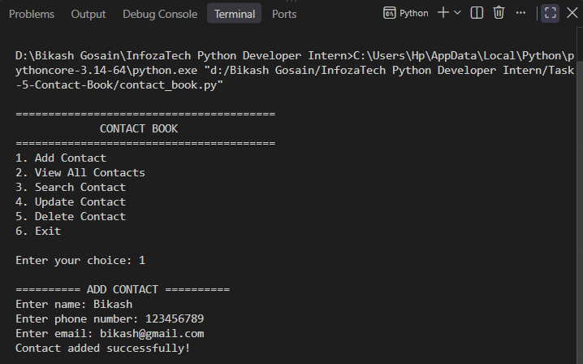
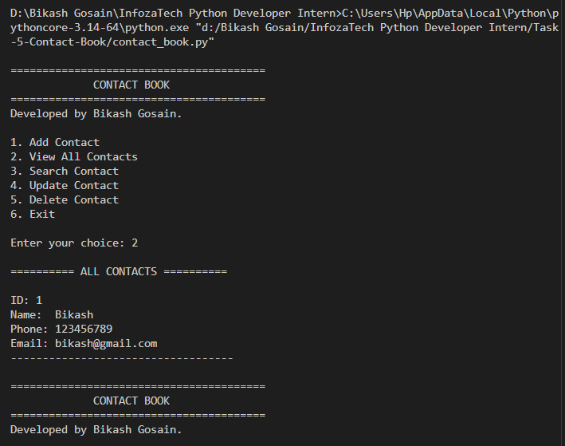
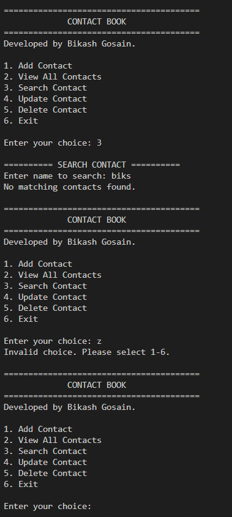
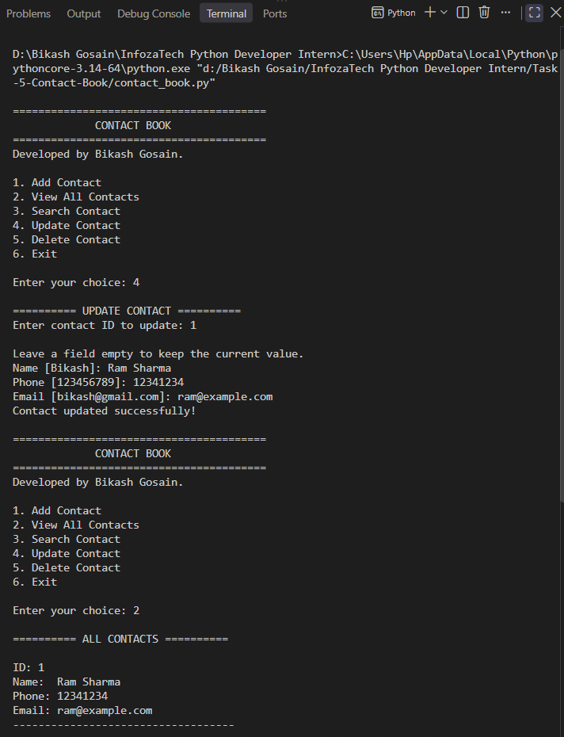
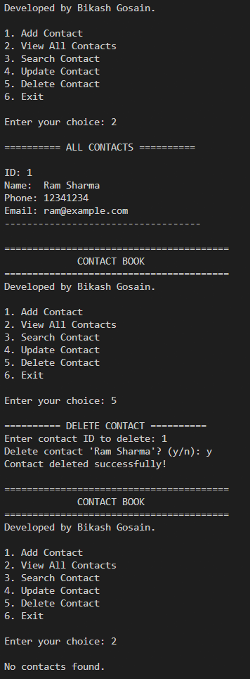
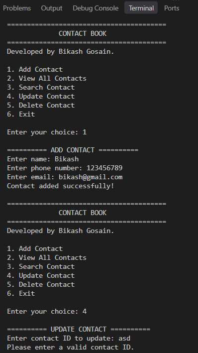

# Task 5 – Contact Book

A Python-based contact management application developed as part of my **InfozaTech Python Programming Virtual Internship**.

## 📌 Overview

This project is a command-line **Contact Book** application that allows users to manage contact information including names, phone numbers, and email addresses.

The application supports adding, viewing, searching, updating, and deleting contacts. All contact data is stored persistently using **SQLite**, so the information is not lost when the application is closed and reopened.

## ✨ Features

* Add new contacts
* Store name, phone number, and email
* Display all saved contacts
* Search contacts by name
* Update existing contact information
* Delete existing contacts
* Input validation
* Persistent data storage using SQLite
* Simple interactive command-line interface

## 🛠️ Technologies Used

* **Python 3**
* **SQLite**
* `sqlite3`
* `pathlib`

## 📂 Project Structure

```text
Task-5-Contact-Book/
├── README.md
├── contact_book.py
├── contacts.db
└── Screenshots/
    ├── add-contact.png
    ├── contact-list.png
    ├── search-contact.png
    ├── update-contact.png
    ├── delete-contact.png
    └── input-validation.png
```

## ▶️ How to Run

Make sure Python is installed on your system.

Run the following command from the project directory:

```bash
python contact_book.py
```

The SQLite database `contacts.db` will be created automatically when the application starts.

## 🖥️ Application Menu

```text
========================================
             CONTACT BOOK
========================================
1. Add Contact
2. View All Contacts
3. Search Contact
4. Update Contact
5. Delete Contact
6. Exit
```

## 1. Add Contact

The user can add a new contact by entering a name, phone number, and email address.

Example:

```text
========== ADD CONTACT ==========

Enter name: Ram Sharma
Enter phone number: 9841234567
Enter email: ram@example.com

Contact added successfully!
```

### Screenshot



## 2. View All Contacts

All saved contacts are displayed in a readable format, including their unique ID, name, phone number, and email.

Example:

```text
========== ALL CONTACTS ==========

ID: 1
Name:  Ram Sharma
Phone: 9841234567
Email: ram@example.com
-----------------------------------

ID: 2
Name:  Sita Sharma
Phone: 9812345678
Email: sita@example.com
-----------------------------------
```

### Screenshot



## 3. Search Contact

Users can search for a contact by entering a full name or part of a name.

Example:

```text
========== SEARCH CONTACT ==========

Enter name to search: Ram

========== SEARCH RESULTS ==========

ID: 1
Name:  Ram Sharma
Phone: 9841234567
Email: ram@example.com
-----------------------------------
```

The search uses a partial-name match, making it easier to find contacts without entering the complete name.

### Screenshot



## 4. Update Contact

Users can update an existing contact by providing its contact ID.

The application displays the current information and allows individual fields to be changed. Leaving a field empty keeps its existing value.

Example:

```text
========== UPDATE CONTACT ==========

Enter contact ID to update: 1

Leave a field empty to keep the current value.

Name [Ram Sharma]: Ram Kumar
Phone [9841234567]:
Email [ram@example.com]:

Contact updated successfully!
```

### Screenshot



## 5. Delete Contact

Users can delete an existing contact by providing its contact ID.

The application asks for confirmation before permanently deleting the contact.

Example:

```text
========== DELETE CONTACT ==========

Enter contact ID to delete: 2
Delete contact 'Sita Sharma'? (y/n): y

Contact deleted successfully!
```

### Screenshot



## 6. Input Validation

The application handles invalid input, such as entering a non-numeric contact ID.

Example:

```text
Enter contact ID to update: abc
Please enter a valid contact ID.
```

The application also validates required fields when adding a new contact.

### Screenshot



## 💾 Database & Data Persistence

This application uses **SQLite** for persistent data storage.

The database file is:

```text
contacts.db
```

The database contains a `contacts` table with the following fields:

| Field   | Type    | Description           |
| ------- | ------- | --------------------- |
| `id`    | INTEGER | Unique contact ID     |
| `name`  | TEXT    | Contact name          |
| `phone` | TEXT    | Contact phone number  |
| `email` | TEXT    | Contact email address |

The database is automatically created when the application starts if it does not already exist.

Because the contacts are stored in SQLite, they remain available even after the application is closed and restarted.

## 🔄 CRUD Operations

This project demonstrates the four fundamental database operations:

| Operation  | Feature                            |
| ---------- | ---------------------------------- |
| **Create** | Add Contact                        |
| **Read**   | View All Contacts / Search Contact |
| **Update** | Update Contact                     |
| **Delete** | Delete Contact                     |

## 🔒 Database Safety

The application uses parameterized SQL queries when inserting, searching, updating, and deleting contacts.

For example:

```python
cursor.execute(
    "SELECT name FROM contacts WHERE id = ?",
    (contact_id,)
)
```

Using parameterized queries helps prevent SQL injection when working with user-provided values.

## 📚 What I Learned

Through this task, I practiced:

* Python functions and modular programming
* Building command-line applications
* SQLite database operations
* CRUD operations
* SQL queries
* Parameterized SQL queries
* Database persistence
* User input validation
* Searching database records
* Updating and deleting database records
* Using `sqlite3` with Python
* Managing database file paths with `pathlib`

## 🎯 Internship Requirements

This project implements all assigned requirements:

| Requirement             | Implementation                                      |
| ----------------------- | --------------------------------------------------- |
| Add a new contact       | Name, phone number, and email can be entered        |
| Display saved contacts  | All contacts are displayed in a readable list       |
| Search by name          | Supports full or partial name searches              |
| Update existing contact | Contact details can be updated using the contact ID |
| Delete existing contact | Contacts can be deleted with confirmation           |
| Persistent storage      | Contacts are stored in an SQLite database           |

## 🎓 Internship

This project was completed as **Task 5** of my **4-week Python Programming Virtual Internship at InfozaTech**.

**Internship Duration:** 10 September 2026 – 10 October 2026

**Role:** Python Programming Intern
